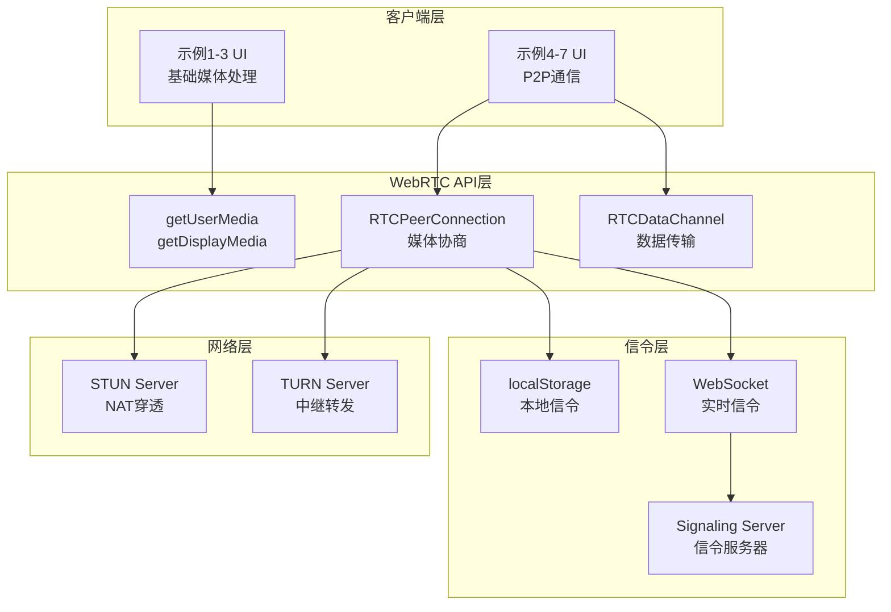
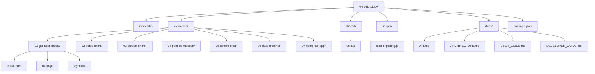
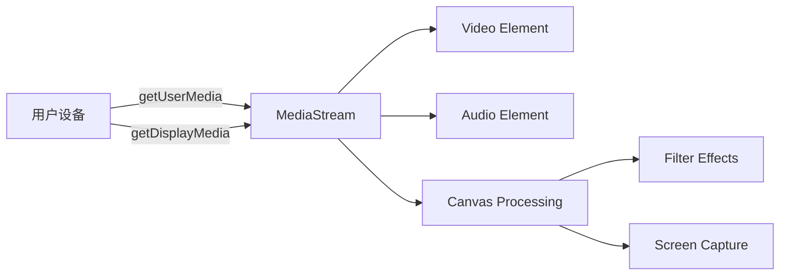
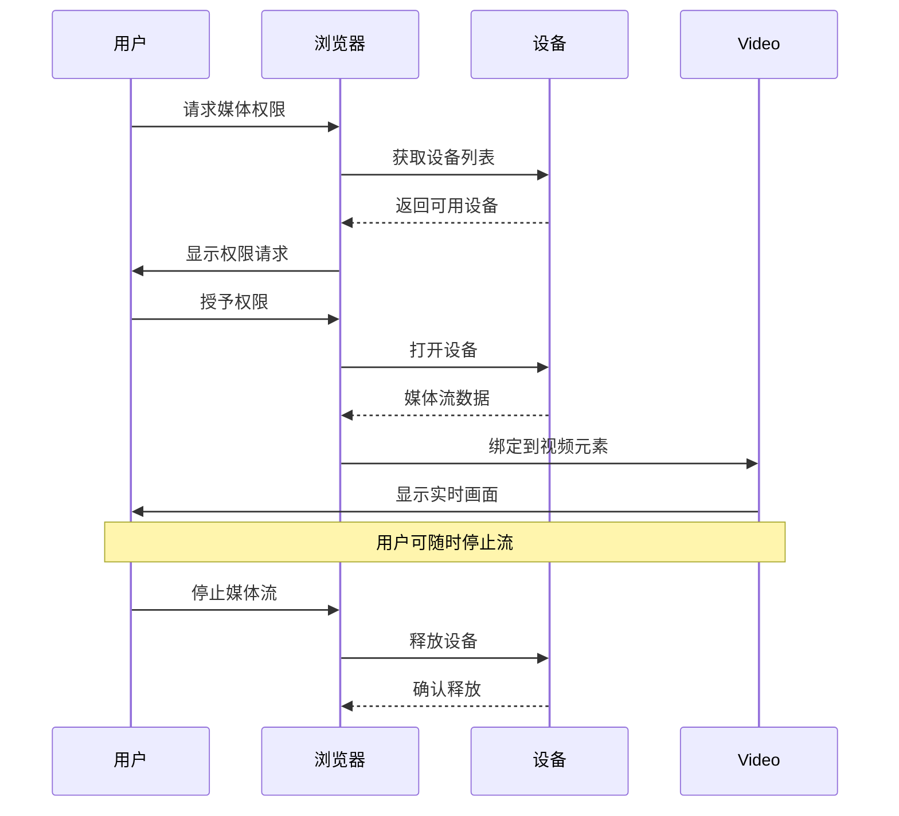
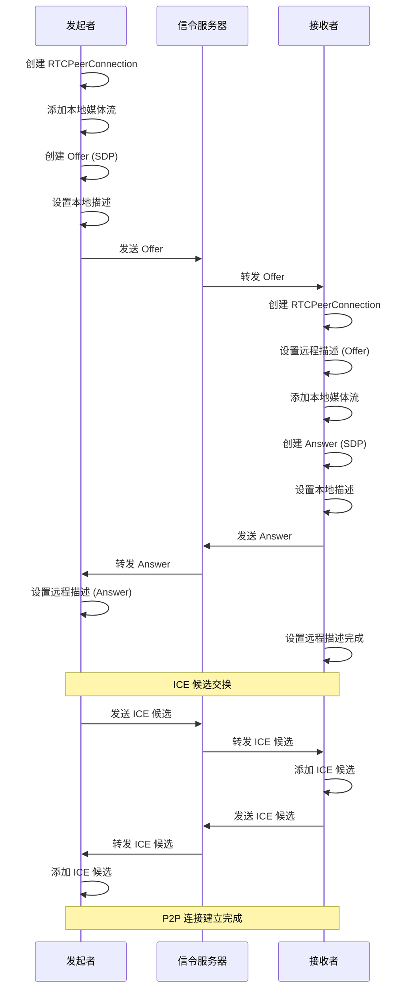
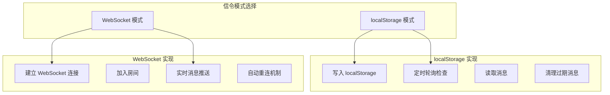
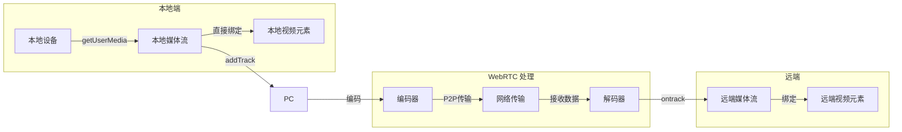
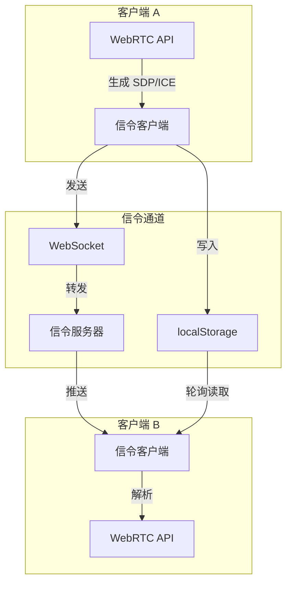

# WebRTC 学习项目架构文档

## 概述

本文档详细描述了 WebRTC 渐进式学习项目的系统架构、组件设计、数据流和交互流程。

## 系统架构图



## 项目结构



## 核心组件架构

### 1. 媒体流处理组件



#### 媒体流生命周期


### 2. P2P 连接组件

```mermaid
graph TB
    subgraph "发起者 (Offerer)"
        O1[创建 RTCPeerConnection]
        O2[添加本地流]
        O3[创建 Offer]
        O4[设置本地描述]
        O5[发送 Offer]
        O6[接收 Answer]
        O7[ICE 候选交换]
    end

    subgraph "接收者 (Answerer)"
        A1[创建 RTCPeerConnection]
        A2[接收 Offer]
        A3[设置远程描述]
        A4[创建 Answer]
        A5[设置本地描述]
        A6[发送 Answer]
        A7[ICE 候选交换]
    end

    O5 -.信令通道.-.> A2
    A6 -.> O6
    O7 -.> A7
```

#### 连接建立流程


### 3. 信令系统架构

#### 双模式信令设计


#### WebSocket 信令服务器架构
```javascript
// 信令服务器核心类设计
class SignalingServer {
    constructor() {
        this.clients = new Map();     // 存储客户端连接
        this.rooms = new Map();       // 存储房间信息
        this.clientRooms = new Map(); // 客户端-房间映射
    }

    // 处理客户端连接
    handleConnection(ws) {
        const clientId = generateUUID();
        this.clients.set(clientId, {
            ws: ws,
            role: null,
            roomId: null
        });
    }

    // 处理消息路由
    handleMessage(clientId, message) {
        const { type, payload } = message;

        switch(type) {
            case 'join':
                this.handleJoin(clientId, payload);
                break;
            case 'offer':
            case 'answer':
            case 'ice-candidate':
                this.forwardToPeer(clientId, message);
                break;
        }
    }

    // 房间管理
    manageRooms() {
        // 创建房间、匹配对等方、清理空房间
    }
}
```

## 数据流设计

### 1. 媒体数据流


### 2. 信令数据流


## 模块设计

### 1. 工具模块 (shared/utils.js)
```javascript
// 工具函数模块化设计
const Utils = {
    // UUID 生成器
    generateUUID: () => {
        return 'xxxxxxxx-xxxx-4xxx-yxxx-xxxxxxxxxxxx'.replace(/[xy]/g, function(c) {
            const r = Math.random() * 16 | 0;
            const v = c === 'x' ? r : (r & 0x3 | 0x8);
            return v.toString(16);
        });
    },

    // 浏览器检测
    getBrowserInfo: () => {
        const ua = navigator.userAgent;
        // 解析浏览器名称和版本
        return {
            name: browserName,
            version: browserVersion,
            isSupported: checkWebRTCSupport()
        };
    },

    // 错误处理
    handleError: (error) => {
        const errorMap = {
            'NotAllowedError': '用户拒绝了权限请求',
            'NotFoundError': '未找到指定设备',
            // ... 更多错误映射
        };

        return {
            code: error.name,
            message: errorMap[error.name] || error.message,
            original: error
        };
    }
};
```

### 2. 信令客户端抽象
```javascript
// 信令客户端基类
class SignalingClient {
    constructor(options) {
        this.onMessage = options.onMessage;
        this.onStatusChange = options.onStatusChange;
        this.connected = false;
    }

    // 抽象方法，子类实现
    connect() {
        throw new Error('connect() must be implemented');
    }

    send(type, payload) {
        throw new Error('send() must be implemented');
    }

    disconnect() {
        throw new Error('disconnect() must be implemented');
    }
}

// localStorage 实现
class LocalStorageSignaling extends SignalingClient {
    constructor(options) {
        super(options);
        this.interval = null;
    }

    connect() {
        this.connected = true;
        this.startPolling();
    }

    startPolling() {
        this.interval = setInterval(() => {
            // 检查 localStorage 中的消息
            this.checkMessages();
        }, 500);
    }
}

// WebSocket 实现
class WebSocketSignaling extends SignalingClient {
    constructor(url, options) {
        super(options);
        this.url = url;
        this.ws = null;
    }

    connect() {
        this.ws = new WebSocket(this.url);
        this.setupEventHandlers();
    }

    setupEventHandlers() {
        this.ws.onopen = () => {
            this.connected = true;
            this.onStatusChange('connected');
        };

        this.ws.onmessage = (event) => {
            const message = JSON.parse(event.data);
            this.onMessage(message.type, message.payload);
        };
    }
}
```

## 性能优化设计

### 1. 媒体流优化
```javascript
// 自适应码率
function getOptimalConstraints() {
    const connection = navigator.connection || navigator.mozConnection || navigator.webkitConnection;

    if (connection) {
        if (connection.effectiveType === '2g') {
            return { video: false, audio: true }; // 2G 网络只传输音频
        } else if (connection.effectiveType === '3g') {
            return {
                video: { width: 320, height: 240, frameRate: 15 },
                audio: true
            };
        }
    }

    // 默认高清配置
    return {
        video: { width: 1280, height: 720, frameRate: 30 },
        audio: true
    };
}
```

### 2. ICE 候选优化
```javascript
// ICE 候选筛选
function filterIceCandidates(candidate) {
    // 优先使用 HOST 类型候选
    if (candidate.type === 'host') {
        return 1;
    } else if (candidate.type === 'srflx') {
        return 2;
    } else if (candidate.type === 'relay') {
        return 3;
    }
    return 4;
}
```

## 安全设计

### 1. 权限管理
```javascript
// 权限检查
async function checkPermissions() {
    if (!navigator.permissions) {
        return { camera: 'unknown', microphone: 'unknown' };
    }

    const camera = await navigator.permissions.query({ name: 'camera' });
    const microphone = await navigator.permissions.query({ name: 'microphone' });

    return {
        camera: camera.state, // 'granted', 'denied', 'prompt'
        microphone: microphone.state
    };
}
```

### 2. 安全上下文检查
```javascript
function isSecureContext() {
    return (
        location.protocol === 'https:' ||
        location.hostname === 'localhost' ||
        location.hostname === '127.0.0.1' ||
        location.hostname === ''
    );
}
```

## 扩展性设计

### 1. 插件化架构
```javascript
// 插件接口设计
class WebRTCPlugin {
    constructor(name) {
        this.name = name;
        this.version = '1.0.0';
    }

    // 初始化插件
    init(options) {
        throw new Error('init() must be implemented');
    }

    // 处理媒体流
    processStream(stream) {
        throw new Error('processStream() must be implemented');
    }

    // 销毁插件
    destroy() {
        throw new Error('destroy() must be implemented');
    }
}

// 示例：美颜插件
class BeautyPlugin extends WebRTCPlugin {
    processStream(stream) {
        // 获取视频轨道
        const videoTrack = stream.getVideoTracks()[0];

        // 创建处理后的流
        const processedStream = this.applyBeautyEffect(videoTrack);

        return processedStream;
    }
}
```

### 2. 配置管理
```javascript
// 集中配置管理
const Config = {
    // WebRTC 配置
    webrtc: {
        iceServers: [
            { urls: 'stun:stun.l.google.com:19302' }
        ],
        iceTransportPolicy: 'all',
        bundlePolicy: 'max-bundle'
    },

    // 媒体配置
    media: {
        video: {
            width: { ideal: 1280 },
            height: { ideal: 720 },
            frameRate: { ideal: 30 }
        },
        audio: {
            echoCancellation: true,
            noiseSuppression: true
        }
    },

    // 信令配置
    signaling: {
        type: 'websocket', // 'localStorage' | 'websocket'
        wsUrl: 'ws://localhost:8080',
        reconnectAttempts: 5,
        reconnectDelay: 3000
    }
};
```

## 监控与调试

### 1. 连接状态监控
```javascript
// 连接状态追踪
class ConnectionMonitor {
    constructor(peerConnection) {
        this.pc = peerConnection;
        this.stats = {
            connectionState: 'new',
            iceConnectionState: 'new',
            signalingState: 'stable',
            bytesSent: 0,
            bytesReceived: 0,
            packetsLost: 0
        };

        this.setupMonitoring();
    }

    setupMonitoring() {
        this.pc.onconnectionstatechange = () => {
            this.stats.connectionState = this.pc.connectionState;
            this.report('connectionState', this.stats.connectionState);
        };

        this.pc.oniceconnectionstatechange = () => {
            this.stats.iceConnectionState = this.pc.iceConnectionState;
            this.report('iceConnectionState', this.stats.iceConnectionState);
        };

        // 定期获取统计信息
        setInterval(async () => {
            const stats = await this.pc.getStats();
            this.processStats(stats);
        }, 5000);
    }
}
```

### 2. 日志系统
```javascript
// 分级日志系统
const Logger = {
    levels: {
        DEBUG: 0,
        INFO: 1,
        WARN: 2,
        ERROR: 3
    },

    currentLevel: 1, // INFO

    log(level, message, data) {
        if (level >= this.currentLevel) {
            const timestamp = new Date().toISOString();
            console[level](`[${timestamp}] ${message}`, data || '');

            // 可扩展：发送到日志服务器
            this.sendToServer(level, message, data);
        }
    },

    debug(message, data) {
        this.log(this.levels.DEBUG, message, data);
    },

    info(message, data) {
        this.log(this.levels.INFO, message, data);
    },

    warn(message, data) {
        this.log(this.levels.WARN, message, data);
    },

    error(message, data) {
        this.log(this.levels.ERROR, message, data);
    }
};
```

## 部署架构

### 1. 本地开发环境
```yaml
# docker-compose.yml
version: '3.8'
services:
  app:
    image: nginx:alpine
    ports:
      - "8080:80"
    volumes:
      - ./:/usr/share/nginx/html

  signaling:
    image: node:14-alpine
    working_dir: /app
    volumes:
      - ./scripts:/app
    command: node start-signaling.js
    ports:
      - "8081:8080"
```

### 2. 生产环境部署
```yaml
# production.yml
version: '3.8'
services:
  nginx:
    image: nginx:alpine
    ports:
      - "443:443"
      - "80:80"
    volumes:
      - ./nginx.conf:/etc/nginx/nginx.conf
      - ./ssl:/etc/nginx/ssl
    depends_on:
      - app
      - signaling

  app:
    image: webrtc-study:latest
    environment:
      - NODE_ENV=production
      - HTTPS=true

  signaling:
    image: webrtc-signaling:latest
    environment:
      - NODE_ENV=production
      - REDIS_URL=redis://redis:6379
    depends_on:
      - redis

  redis:
    image: redis:alpine
    volumes:
      - redis-data:/data

volumes:
  redis-data:
```

## 总结

本架构设计具有以下特点：

1. **模块化设计**: 各组件职责清晰，便于维护和扩展
2. **渐进式学习**: 从简单到复杂，逐步引入新概念
3. **双模式信令**: 支持本地测试和生产环境
4. **中文友好**: 全中文注释和文档
5. **实战导向**: 每个示例都有实际应用场景
6. **性能优化**: 包含多种优化策略
7. **安全可靠**: 考虑权限和安全上下文
8. **易于部署**: 支持多种部署方式

该架构为 WebRTC 学习者提供了一个完整、实用的学习平台。通过逐步深入的方式，帮助开发者掌握 WebRTC 的核心技术和最佳实践。